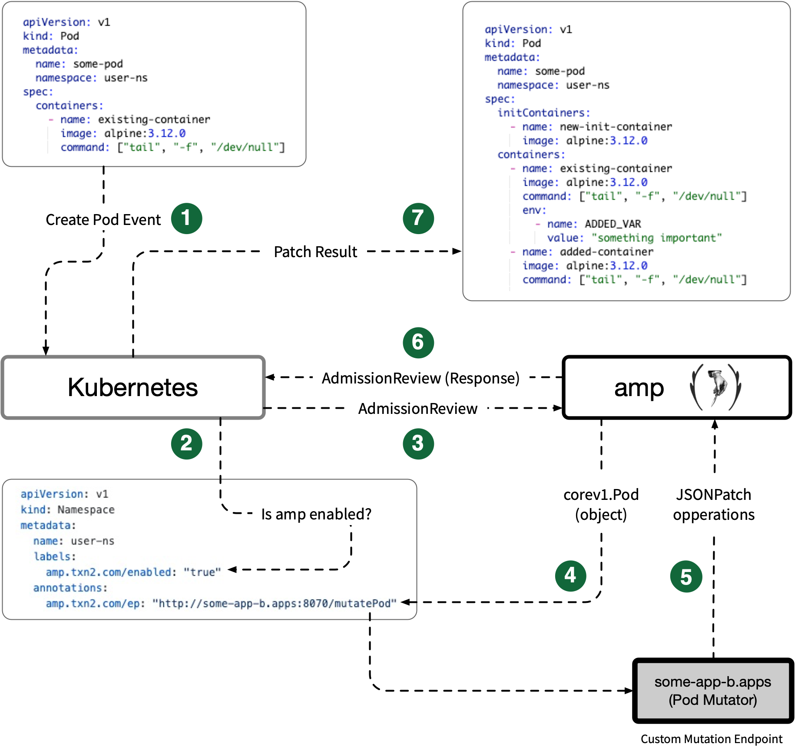

# Kubernetes Admission Mutation Proxy (amp)

`amp` is a Kubernetes [Dynamic Admission Control](https://kubernetes.io/docs/reference/access-authn-authz/extensible-admission-controllers/) mutating webhook **proxy** for Pods.

## Motivation

The `amp` project focuses on simplifying the process of modifying Kubernetes Pods on creation through custom endpoints, adding, removing, and modifying init containers, volumes, environment variables, or any other component of the Pod specification.  The `amp` project originally stemmed from the need to add custom volumes and environment variables to Pods created by [JupyterHub](https://zero-to-jupyterhub.readthedocs.io/en/latest/); however, `amp` is useful for extending any system that creates Pods that should be interrogated and mutated with external resources and values. In the [JupyterHub](https://zero-to-jupyterhub.readthedocs.io/en/latest/) use case, JupyterHub [spawns](https://github.com/jupyterhub/kubespawner) a Pod for a user into a Namespace, Kubernetes notifies `amp` and `amp` send the Pod specification to a custom endpoint. The custom endpoint retrieves a username from a Pod annotation and sends patch operations back to `amp`, modifying the Pod with user-specific environment variables and volume mounts.

## Overview
`amp` receives Kubernetes Admission Review requests for Pod creation events from any Namespace labeled `amp.txn2.com/enabled=true` and forwards the [Pod definition](https://kubernetes.io/docs/reference/generated/kubernetes-api/v1.18/#pod-v1-core) as a JSON POST to a custom HTTP endpoint defined through the value of the Namespace annotation `amp.txn2.com/ep`.  The custom HTTP endpoint receives a Pod definition for evaluation and returns an array of [JSONPatch](http://jsonpatch.com/) operations to `amp` (see [example](https://github.com/txn2/amp-wh-example/blob/c58b545f9739b95a110ff22eac1ec6c47a4943a4/amp_wh_example.go#L113)).

The following depiction illustrates a high-level view of an example endpoint named `some-app-b` mutating a Pod:



1. Kubernetes receives a Pod creation event.

2. Kubernetes [MutatingWebhookConfiguration](https://github.com/txn2/amp/blob/master/k8s/80-webhook.yml) for `amp` matches any Namespace labeled `amp.txn2.com/enabled: true`.

3. Kubernetes sends an `AdmissionReview` object to `amp`.

4. `amp` extracts the `corev1.Pod` object from the `AdmissionReview`, looks up the custom endpoint annotated in the Pod's Namespace and sends an HTTP POST of the `corev1.Pod` as JSON to the endpoint.

5. `amp` receives a JSON encoded array of [PatchOperations](https://github.com/txn2/amp-wh-example/blob/master/amp_wh_example.go#L28) for the `corev1.Pod`.

6. `amp` responds to Kubernetes AdmissionReview with the received PatchOperations as a response.

7. Kubernetes creates the new mutated Pod.

### Example patch operations
```go
[]PatchOperation{
    // add initContainer
    {
        Op:   "add",
        Path: "/spec/initContainers/-",
        Value: corev1.Container{
            Name:  "new-init-container",
            Image: "alpine:3.12.0",
        },
    },
    // add environment variable to container 0 first-existing-container
    {
        Op:   "add",
        Path: "/spec/containers/0/env/-",
        Value: corev1.EnvVar{
            Name:  "ADDED_VAR",
            Value: "somthing important",
        },
    },
}
```

## Example Implementation

Refer to the example implementation at [txn2/amp-wh-example](https://github.com/txn2/amp-wh-example).

## Install

```shell script
git clone git@github.com:txn2/amp.git
cd amp

# create amp-system namespace
kubectl apply -f ./k8s/00-namespace.yml
```

Create Certificate as Kubernets Secret in the new `amp-system` Namespace:

```shell script
curl https://raw.githubusercontent.com/morvencao/kube-mutating-webhook-tutorial/master/deployment/webhook-create-signed-cert.sh -o cert-gen.sh

chmod 775 cert-gen.sh

./cert-gen.sh --service amp --namespace amp-system --secret amp-cert
```

Create RBAC access controls, a Service and `amp` Deployment:
```shell script
# setup rbac for apm
kubectl apply -f ./k8s/01-rbac.yml

# create the amp service used by the webhook configuration
kubectl apply -f ./k8s/10-service.yml

# create the amp deployment
kubectl apply -f ./k8s/30-deployment.yml
```

Create a `caBundle` required for the `./k8s/80-webhook.yml` configuration:
```shell script
kubectl config view --raw --minify --flatten -o jsonpath='{.clusters[].cluster.certificate-authority-data}'
```

Replace the `caBundle` key in `./k8s/80-webhook.yml` with the value returned from the previous command and apply the following webhook configuration:

```shell script
kubectl apply -f ./k8s/80-webhook.yml
```

## Development

### Release
```bash
goreleaser --skip-publish --rm-dist --skip-validate
```

```bash
GITHUB_TOKEN=$GITHUB_TOKEN goreleaser --rm-dist
```
